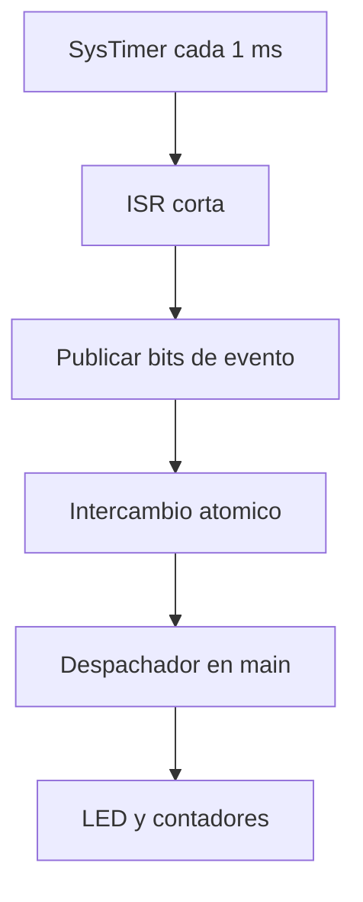

# Exercise 05 - Interrupciones y banderas de eventos en GD32VW553

**Curso:** Estructuras Computacionales  
**Autora:** Laura Daniela Barragan Silva  
**Plataforma:** GD32VW553HMQ6/HMQ7  
**Arquitectura:** Nuclei RISC-V RV32  
**Entorno:** Visual Studio Code, CMake, Ninja, Nuclei RISC-V GCC y OpenOCD

## 1. Proposito

Este ejercicio separa el sistema en dos contextos:

- la interrupcion de SysTimer, que genera y publica eventos;
- el bucle principal, que reclama esos eventos y ejecuta el trabajo.

La ISR no controla el LED directamente. Publica banderas de 250 ms, un segundo
y cinco segundos mediante operaciones atomicas. `main()` procesa una fotografia
de las banderas sin perder un evento que llegue simultaneamente.

## 2. Resultado esperado

El LED PC13 alterna entre dos modos:

1. durante cinco segundos cambia cada 500 ms (modo lento);
2. durante cinco segundos cambia cada 250 ms (modo rapido);
3. la secuencia se repite indefinidamente.

## 3. Flujo de interrupcion y trabajo diferido



## 4. Mapa de banderas

| Evento | Mascara | Periodo | Trabajo en `main` |
| --- | ---: | ---: | --- |
| `EVENT_LED_TICK` | `0x01` | 250 ms | Actualizar el LED |
| `EVENT_ONE_SECOND` | `0x02` | 1000 ms | Contar segundos atendidos |
| `EVENT_MODE_CHANGE` | `0x04` | 5000 ms | Alternar lento/rapido |

En múltiplos de cinco segundos las tres banderas pueden aparecer juntas:

```text
0x01 | 0x02 | 0x04 = 0x07
```

## 5. Operacion atomica RISC-V

La ISR usa `__atomic_fetch_or()` para añadir bits y `main()` usa
`__atomic_exchange_n()` para obtener y limpiar las banderas en una operacion
indivisible. En este procesador, la extension atomica **A** permite implementar
estas operaciones sin una ventana de carrera entre lectura y escritura.

## 6. Variables de depuracion

```text
g_event_flags
g_last_event_snapshot
g_isr_count
g_events_published
g_event_batches
g_seconds_handled
g_blink_mode
g_mode_changes
g_led_toggle_count
g_background_iterations
```

## 7. Estructura

```text
05_Interrupt_Event_Flags/
├── .vscode/
├── Doc/
├── Inc/
│   ├── events.h
│   └── gd32vw55x_libopt.h
├── Src/
│   ├── events.c
│   └── main.c
├── cmake/
├── tools/
├── CMakeLists.txt
└── CMakePresets.json
```

## 8. Preparacion rapida

1. Reutilice `tools/local_config.ps1` de la guia general.
2. Abra la carpeta con `code .`.
3. Ejecute `Verify GD32 Environment`.
4. Ejecute `Build + Flash GD32 Events`.
5. Genere `launch.json` y compruebe las variables con breakpoints.

El repositorio excluye `build/`, rutas personales, el SDK, el toolchain,
OpenOCD, `tools/local_config.ps1` y `.vscode/launch.json`.
